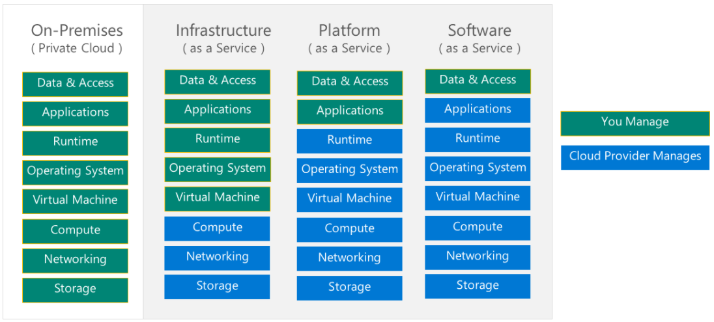

# AZ-204-Guide

## Links of interest

- [Azure case studies and customer stories](https://azure.microsoft.com/en-us/resources/customer-stories/)
- [Global infraestructure](https://infrastructuremap.microsoft.com/)
- [High available multi-region web app](https://learn.microsoft.com/en-us/azure/architecture/reference-architectures/app-service-web-app/multi-region)
- [App Service documentation](https://learn.microsoft.com/en-us/azure/app-service/)
- [Azure Blob Storage documentation](https://learn.microsoft.com/en-us/azure/storage/blobs/)
- [Scalability and performance targets for Blob storage](https://learn.microsoft.com/en-us/azure/storage/blobs/scalability-targets)
- [Functions Documentation](https://learn.microsoft.com/en-us/azure/azure-functions/)
- [Functions Kubernetes with KEDA](https://learn.microsoft.com/en-us/azure/azure-functions/functions-kubernetes-keda)
- [Regions and availability zones](https://learn.microsoft.com/en-us/azure/availability-zones/az-overview)
- [Durable Functions](https://learn.microsoft.com/en-us/azure/azure-functions/durable/)
- [Azure Cosmos DB documentation](https://learn.microsoft.com/en-gb/azure/cosmos-db/)
- [Consistency levels](https://learn.microsoft.com/en-gb/azure/cosmos-db/consistency-levels)
- [How to choose a partition key in Azure Cosmos DB](https://microsoft.github.io/AzureTipsAndTricks/blog/tip335.html)
- [Virtual machines documentation](https://learn.microsoft.com/en-gb/azure/virtual-machines/)
- [Azure CLI Documentation](https://learn.microsoft.com/en-us/cli/azure/)
- [Azure PowerShell Documentation](https://learn.microsoft.com/en-us/powershell/azure/?view=azps-8.3.0)
- [Azure Container Registry documentation](https://learn.microsoft.com/en-us/azure/container-registry/)
- [Azure for .NET developers](https://learn.microsoft.com/en-gb/dotnet/azure/)
- [Azure for Python Developers](https://learn.microsoft.com/en-gb/azure/developer/python/)
- [Azure services that can use managed identities to access other services](https://learn.microsoft.com/en-gb/azure/active-directory/managed-identities-azure-resources/managed-identities-status)

## Tools
- [Azure Pricing Calculator](https://azure.microsoft.com/en-us/pricing/calculator/)
- [Cron expression generator](https://crontab.cronhub.io/)
- [Graph explorer](https://developer.microsoft.com/en-us/graph/graph-explorer)

## Labs and Repos
- [AZ-204 GITHUB](https://github.com/MicrosoftLearning/AZ-204-DevelopingSolutionsforMicrosoftAzure)
- [Labs (just instructions)](https://microsoftlearning.github.io/AZ-204-DevelopingSolutionsforMicrosoftAzure/)
- [Azure AD SDK repos](https://github.com/AzureAD)
- [AZ-204 Learning path](https://learn.microsoft.com/en-us/certifications/exams/az-204)
- [Azure event hubs repo](https://github.com/Azure/azure-event-hubs)

## Exam
- [Exam duration and question typess](https://learn.microsoft.com/en-us/certifications/exam-duration-question-types)
- [Microsoft Official Practice Test AZ-204: Developing Solutions for Microsoft Azure](https://www.measureup.com/microsoft-official-practice-test-az-204-developing-solutions-for-microsoft-azure.html)
- [About online exams with Pearson VUE](https://learn.microsoft.com/en-us/certifications/online-exams)
- [Online proctored exams](https://learn.microsoft.com/en-us/certifications/online-exams-intro)
  
## Tutorials
- [Use a Linux VM system-assigned identity to access Azure Storage via a SAS credential](https://learn.microsoft.com/en-us/azure/active-directory/managed-identities-azure-resources/tutorial-linux-vm-access-storage-sas)
- [Build and deploy container images](https://learn.microsoft.com/en-us/azure/container-registry/container-registry-tutorial-quick-task)
- [How to create durable function in C#](https://learn.microsoft.com/en-us/azure/azure-functions/durable/durable-functions-create-first-csharp?pivots=code-editor-vscode)
- [Quickstart: Deploy an ASP.NET web app](https://learn.microsoft.com/en-us/azure/app-service/quickstart-dotnetcore?tabs=net60&pivots=development-environment-vs)

## Code samples
- [Identities](az204-auth/Readme.md)

## Visuals

**Shared responsibility model**
